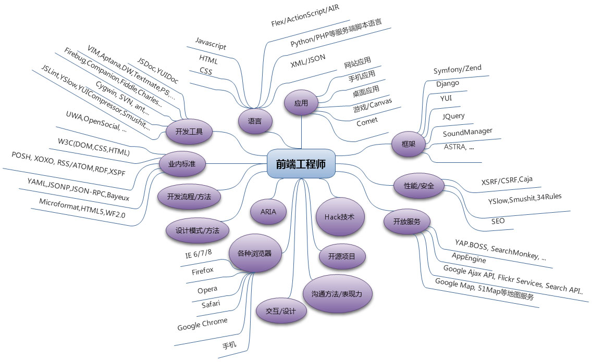

# About-Me
## 自我介绍
我毕业于湖北省武汉市的中南民族大学，视觉传达设计专业(2009级本科)，毕业后在一家电商网站[(卷皮网)](http://www.juanpi.com/)做了两年的平面设计师[(作品链接)](http://huaban.com/boards/25105531/)。  后来在朋友的介绍下，接触到前端这个领域。
有人说一入前端深似海，其实只要你热爱这个行业，一入什么都深似海，关键是要专注打磨自己的技艺。 
前端易学难精，我对此深有体会，虽然不知道现在的自己是什么水平，但是会一直在这里更新记录自己的学习历程。

## 技能树
* 熟练操作Photoshop
* 熟练掌握JavaScript、Ajax、HTML、CSS等基础网页制作开发技术 
* 熟悉Jquery/AngularJS/ReactJS/zepto等前端框架；
* 熟悉React
* 了解ES6新特性
* 了解前端自动化，熟悉gulp，webpack等工具常见用法；
* 会使用svn和git等版本控制软件
##在校奖励
